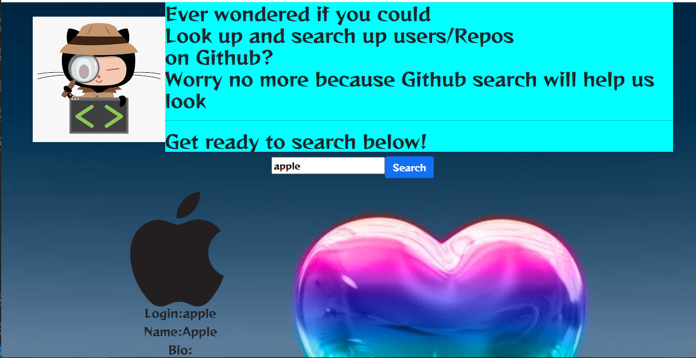

   # GIT SEARCHER &#10024;
   
This project was generated with [Angular CLI](https://github.com/angular/angular-cli) version 11.2.12.
# PROJECT DESCRIPTION &#127800;
 A website where users may enter a GitHub username into a form, submit it, and see names and descriptions of that person's public repositories. Any person can look for the repositories.
#### Expected output &#10024;
| Actions  | Result        |
| :-------------: |:--------------:|
| Search User      | display user profile details & repositories |
| Click on username      | Redirected to github profile for the user      |
| click on repository title | Redirected to repository link on github      |
 # TECHNOLOGIES USED &#10024;
 These are:<ul>
        <li>CSS</li>
        <li>Javascript</li>
        <li>Bootstrap</li>
        <li>HTML</li>
        <li>Typescript</li>
             </ul>
# THE AUTHOR &#129409;
<ul>
<li>jimmy-oss</li>
    </ul>
    
If there is a pending information I can use to improve the project please feel free to email,
that is jimmynjonge51@gmail.com.
# BEHAVIOUR DRIVEN DEVELOPMENT &#10024;
The project consists of components which are the parent component and the child component files in angular.The child component is responsible for receiving data from a parent component inorder for the project to 
work.
# THE LICENSE  &#127800;
The app is under mit license.

## Development server &#10024;

Run `ng serve` for a dev server. Navigate to `http://localhost:4200/`. The app will automatically reload if you change any of the source files.

## Code scaffolding &#127800;

Run `ng generate component component-name` to generate a new component. You can also use `ng generate directive|pipe|service|class|guard|interface|enum|module`.

## Build &#10024;

Run `ng build` to build the project. The build artifacts will be stored in the `dist/` directory. Use the `--prod` flag for a production build.

## Running unit tests &#127800;

Run `ng test` to execute the unit tests via [Karma](https://karma-runner.github.io).

## Running end-to-end tests &#10024;

Run `ng e2e` to execute the end-to-end tests via [Protractor](http://www.protractortest.org/).

## Further help  &#127800;

To get more help on the Angular CLI use `ng help` or go check out the [Angular CLI Overview and Command Reference](https://angular.io/cli) page.
